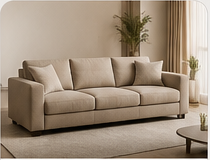

# Panduan Edit Cepat Website Nara Living

Website ini sudah dibuat ulang mengikuti referensi desain: hero besar dengan sofa, panel keunggulan, katalog sofa, koleksi bahan/warna, proses pemesanan, dan CTA WhatsApp.

## File utama

- `index.html` untuk struktur konten website.
- `style.css` untuk tampilan, warna, layout, responsive mobile.
- `script.js` untuk menu mobile, popup detail produk, dan tombol WhatsApp.
- Folder `images/` untuk gambar hero, katalog, dan bahan sofa.

## Cara ganti nomor WhatsApp

Buka `index.html` dan `script.js`, cari nomor:

```txt
6282195842319
```

Ganti dengan nomor WhatsApp baru memakai format kode negara, tanpa tanda `+`.

## Cara ganti gambar katalog

Masukkan gambar baru ke folder `images`, lalu buka `index.html` dan ubah bagian:

```html

```

Ganti nama file sesuai gambar baru.

## Upload ke GitHub

```bash
git add .
git commit -m "Update website Nara Living"
git push origin main
```

## Struktur folder

```txt
Nara website/
├── images/
├── index.html
├── style.css
├── script.js
├── README_EDIT.md
└── netlify.toml
```
